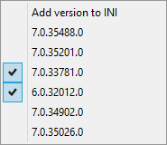

BuildBuddy
==========
This small AutoHotkey script is made so you can choose which build that the registry should link to currently.
All gathered up in a small popup menu.

Standard hotkey: Win+n (Can be changed in the script file)

Prerequisite
------------
* [AutoHotkey](http://www.autohotkey.com)
* Dynamics Nav / Navision

How to
------
1. Download [BuildBubby.ahk](https://github.com/SShadowS/BuildBuddy/blob/master/NavVersionSelected.ahk).
2. Right click the script and press 'Run as administrator'

Features
--------
- Save builds to file
- Dynamic menu
- Change registry settings

On the drawing board
--------------------
- Menu sorting
- Menu tree by Navision version
